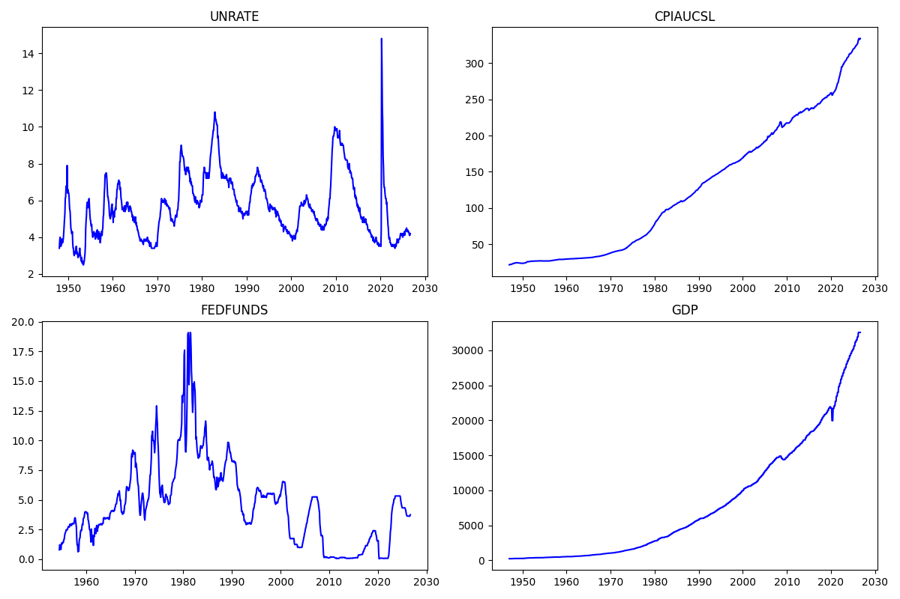

# FRED Economic Data Pipeline

An end-to-end data engineering pipeline that collects U.S. macroeconomic indicators from the FRED API, cleans and aligns them, stores them in PostgreSQL, and produces analysis and charts.



## Pipeline

```
FRED API → extract → transform → load (PostgreSQL) → analyze → visualize
```

| Module | Responsibility |
|---|---|
| `src/extract.py` | Calls the FRED API for each series listed in `config/series.yaml`, with HTTP error checks and rate-limit spacing |
| `src/transform.py` | Cleans raw JSON, aligns series by date (outer join), forward-fills lower-frequency series |
| `src/load.py` | Idempotent upserts into PostgreSQL (`date` as primary key, ON CONFLICT DO UPDATE) |
| `src/analyze.py` | Percentage change, 12-month moving average, correlation matrix |
| `src/visualize.py` | Multi-panel chart of all indicators |
| `main.py` | Orchestrates the pipeline with structured logging and a daily schedule |

## Indicators

`UNRATE` (unemployment), `CPIAUCSL` (CPI), `FEDFUNDS` (federal funds rate), `GDP`. Add or remove series in `config/series.yaml`, no code changes needed.

## Setup

```bash
git clone https://github.com/vitinhoBig/fred-econ-pipeline.git
cd fred-econ-pipeline
python3 -m venv venv
source venv/bin/activate
pip install -r requirements.txt

# PostgreSQL (macOS / Homebrew)
brew install postgresql@18
brew services start postgresql@18
createdb fred_econ

# Credentials and connection
echo "FRED_API_KEY=your_key_here" > .env
echo "DATABASE_URL=postgresql://localhost/fred_econ" >> .env
```

Get a free API key at https://fredaccount.stlouisfed.org/apikeys

## Usage

```bash
python main.py            # runs once, then daily at 08:00
python src/analyze.py     # analysis on the stored data
python src/visualize.py   # regenerates the chart
python -m pytest          # unit tests
```

## Design decisions

- **Idempotent loads:** `date` is the primary key and rows are written with `INSERT... ON CONFLICT(date) DO UPDATE`, so re-running never duplicates data and FRED revisions to historical values (e.g. GDP) overwrite the stored ones.
- **FRED missing values:** FRED encodes missing observations as `"."`. These are converted to `NaN` with `pd.to_numeric(errors="coerce")`.
- **Mixed frequencies:** monthly and quarterly series are joined on date, and quarterly values (GDP) are forward-filled, never back-filled, to avoid using future information.
- **Decoupled stages:** analysis reads from the database instead of the API, so it can run any time without using API calls.
- **Observability:** logs go to `logs/pipeline.log` and the console, and pipeline failures are caught and logged.
- **Tests without network:** unit tests use small synthetic datasets instead of calling the API.
- **Correlation on changes, not levels:** correlations use quarterly changes (percentage change for level series like CPI and GDP, percentage-point change for rates like UNRATE and FEDFUNDS). Raw levels share long-run trends, which inflates correlations (CPI vs. GDP: 0.97 on levels, 0.45 on changes), and quarterly aggregation avoids the zero-change artifacts that forward-filling creates in monthly data. Spearman rank correlation is reported as an outlier-robustness check.

## Known limitations

- Forward-filled GDP makes monthly `pct_change()` show 0% in filled months. It is an artifact of the fill, not real stability; the correlation analysis avoids it by working at quarterly frequency.
- `GDP` is nominal GsDP, so its correlation with CPI partly reflects inflation feeding nominal growth. Real GDP (`GDPC1`) would isolate real activity.
- Correlations are contemporaneous and sensitive to outliers: UNRATE vs. GDP is -0.70 with Pearson but -0.49 with Spearman, because the 2020 shock inflates the Pearson figure. They show association, not causation.
- The `schedule` loop only works while the process stays alive. A production deployment would use cron or an orchestrator such as Airflow.
- The local PostgreSQL setup uses Homebrew's default passwordless access, which is fine for development only. A deployment would need real credentials managed outside the repo.

## Project structure

```
fred-econ-pipeline/
├── config/series.yaml
├── src/            # extract, transform, load, analyze, visualize
├── tests/
├── main.py
└── requirements.txt
```

## Data source

Data from the Federal Reserve Economic Data (FRED) API. This product uses the FRED® API but is not endorsed or certified by the Federal Reserve Bank of St. Louis.